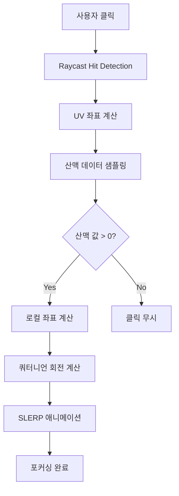
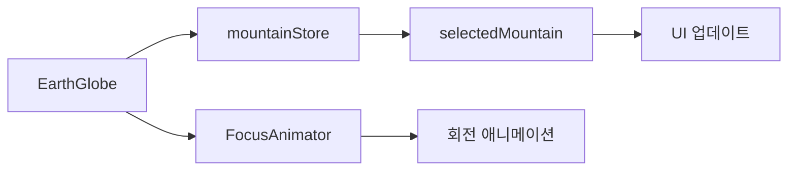

# Geese Crossing - 시스템 아키텍처 분석

## 📋 프로젝트 개요

**Geese Crossing**은 NASA Space App Hackathon을 위한 3D 지구 시각화 애플리케이션입니다. 산맥 데이터를 활용한 인터랙티브 지구본과 클릭 기반 포커싱 시스템을 제공합니다.

### 🎯 주요 기능
- **산맥 클릭 포커싱**: 산맥 픽셀 클릭 시 해당 지점으로 지구본 회전
- **쿼터니언 기반 회전**: 최소 회전으로 부드러운 애니메이션
- **지형 변위**: 고도 데이터를 활용한 3D 지형 표현
- **산맥 마스크 오버레이**: 반투명 산맥 표시
- **주/야 테마**: Mantine 테마 기반 자동 전환

## 🏗️ 기술 스택

### Frontend Framework
- **Next.js 14**: App Router 기반 React 프레임워크
- **React 18**: 클라이언트 사이드 렌더링
- **TypeScript**: 타입 안전성

### 3D Graphics
- **Three.js**: 3D 그래픽스 엔진
- **@react-three/fiber**: Three.js React 래퍼
- **@react-three/drei**: Three.js 유틸리티 컴포넌트

### UI & State Management
- **Mantine 8**: UI 컴포넌트 라이브러리
- **Zustand**: 경량 글로벌 상태 관리
- **@tabler/icons-react**: 아이콘 라이브러리

### Data Processing
- **geotiff**: GeoTIFF 파일 파싱
- **Canvas API**: 텍스처 생성 및 처리

## 📁 프로젝트 구조

```
geese-crossing/
├── app/                          # Next.js App Router
│   ├── globals.css              # 전역 스타일
│   ├── layout.tsx              # 루트 레이아웃
│   ├── page.tsx                # 메인 페이지
│   └── providers.tsx           # Mantine 프로바이더
├── components/
│   ├── atoms/                   # 원자적 컴포넌트
│   │   ├── CameraFollowingLight.tsx
│   │   ├── CameraSetup.tsx
│   │   ├── FocusAnimator.tsx
│   │   └── ThemeControl.tsx
│   ├── organisms/               # 복합 컴포넌트
│   │   ├── EarthGlobe.tsx      # 메인 지구본 컴포넌트
│   │   ├── EarthMesh.tsx       # 지구 메시 및 클릭 처리
│   │   ├── MountainsMaskOverlay.tsx
│   │   ├── PrecipitationOverlay.tsx
│   │   └── header/
│   │       └── Header.tsx
│   ├── store/                   # 상태 관리
│   │   └── mountainStore.ts    # Zustand 스토어
│   └── utils/                   # 유틸리티 함수
│       ├── globeMath.ts        # 지구본 수학 계산
│       ├── mountainRangesData.ts
│       └── textureLoaders.ts   # GeoTIFF 로더
├── public/                      # 정적 자산
│   ├── earth_daymap.jpg        # 주간 지구 텍스처
│   ├── earth_nightmap.jpg      # 야간 지구 텍스처
│   ├── earth.tif              # 고도 데이터
│   └── mountains.tif          # 산맥 데이터
└── styles/
    └── globals.css             # 추가 스타일
```

## 🔄 핵심 아키텍처 플로우

### 1. 클릭 → 포커싱 파이프라인



### 2. 상태 관리 구조



## 🧮 수학적 핵심

### 쿼터니언 기반 회전 계산
```typescript
// 클릭 지점을 카메라 방향으로 회전시키는 최소 회전 계산
export function computePointFocusRotation(
    localPoint: THREE.Vector3, 
    cameraDir: THREE.Vector3
): { rotationX: number; rotationY: number; quaternion: THREE.Quaternion }
```

### 좌표 변환
- **카르테시안 → 위경도**: `cartesianToLatLon()`
- **위경도 → 회전**: `getGlobeRotationForLatLon()`
- **텍스처 좌표 → 픽셀**: UV 매핑

## 🎨 렌더링 파이프라인

### 1. 텍스처 로딩
- **지구 텍스처**: 주/야 자동 전환
- **고도 맵**: 지형 변위용
- **산맥 마스크**: 반투명 오버레이

### 2. 3D 씬 구성
```typescript
<Canvas>
  <ambientLight />
  <CameraFollowingLight />
  <EarthMesh />
  <MountainsMaskOverlay />
  <OrbitControls />
  <FocusAnimator />
</Canvas>
```

## 🔧 성능 최적화

### 적용된 최적화
1. **쿼터니언 SLERP**: 최소 회전 계산
2. **중앙화된 디버그 로깅**: 조건부 로깅
3. **텍스처 Anisotropy**: 최대 품질 설정
4. **조정 가능한 구 세그먼트**: LOD 제어

### 권장 최적화
1. **Web Worker**: GeoTIFF 디코딩 오프로딩
2. **KTX2 압축**: 텍스처 압축
3. **인스턴싱**: 산맥 라인 병합
4. **동적 LOD**: 거리 기반 해상도

## 🐛 디버깅 시스템

### 환경 변수
```bash
NEXT_PUBLIC_DEBUG=true  # 디버그 모드 활성화
```

### 런타임 토글
```javascript
window.__GLOBE_DEBUG__ = true;  // DevTools에서 활성화
```

### 디버그 로깅
```typescript
import { dlog } from "@/components/utils/debugConfig";
dlog("mountain value", val);
```

## 📊 데이터 플로우

### GeoTIFF 처리
1. **로딩**: `geotiff` 라이브러리로 파싱
2. **정규화**: min/max 값으로 0-1 범위 변환
3. **텍스처 생성**: Canvas API로 RGBA 텍스처 생성
4. **샘플링**: 클릭 시 UV 좌표로 원시 값 조회

### 상태 전파
```
클릭 이벤트 → mountainStore → UI 컴포넌트 → 렌더링 업데이트
```

## 🚀 개발 워크플로우

### 개발 서버 실행
```bash
npm install
npm run dev
# http://localhost:3000
```

### 프로덕션 빌드
```bash
npm run build
npm start
```

### 주요 스크립트
- `dev`: 개발 서버
- `build`: 프로덕션 빌드
- `start`: 프로덕션 서버
- `lint`: 코드 린팅

## 🔍 모니터링 및 디버깅

### 성능 프로파일링
- **Chrome Performance**: WebGL Insight 활용
- **Draw Calls**: < 200 목표
- **Shader Compile**: 첫 상호작용 시 지연
- **CPU Scripting**: 낮은 CPU 사용률 유지

### 일반적인 이슈
| 문제 | 확인 사항 |
|------|-----------|
| 텍스처 블러 | Anisotropy & Mipmaps 확인 |
| 클릭 무시 | 산맥 값 ≤ 0 또는 UV 클램프 |
| 잘못된 회전 | 역쿼터니언으로 로컬 포인트 계산 |
| 포커싱 지터 | 단일 포커싱 애니메이션 보장 |

## 📈 확장 가능성

### 향후 개선 사항
1. **GPU 지형 변위**: 셰이더 기반 고도 처리
2. **압축 텍스처**: KTX2/BasisU 지원
3. **동적 라벨링**: 거리 기반 해상도
4. **정상 맵**: 조명 개선

### 테스트 계획
- [ ] 일직선 검증 (< 0.5° 편차)
- [ ] GeoTIFF 정규화 단위 테스트
- [ ] 포커싱 상태 전환 스냅샷
- [ ] 다양한 카메라 각도에서 레이캐스트 회귀

---

이 문서는 Geese Crossing 프로젝트의 전체적인 시스템 아키텍처를 설명합니다. 각 컴포넌트의 세부 구현은 해당 소스 파일을 참조하세요.
